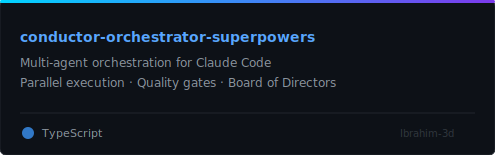
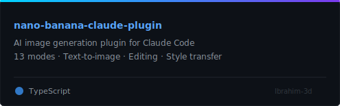
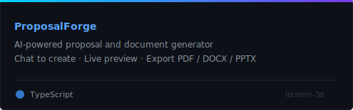
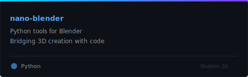

<div align="center">

<!-- HEADER -->


<!-- TYPING SVG -->
<a href="https://git.io/typing-svg"></a>

<br/>

<!-- SOCIAL BADGES -->
[](https://github.com/Ibrahim-3d)
[](https://github.com/Ibrahim-3d)
[](https://github.com/Ibrahim-3d)

</div>

---


## `> whoami`

```js
const ibrahim = {
  title: "Full-Stack AI Engineer",
  location: "Building the future, one agent at a time",
  focus: ["AI Tools", "3D Art", "Claude Code Plugins"],
  currentlyBuilding: "Conductor Orchestrator Superpowers",
  funFact: "I make AI agents work together like an orchestra"
};
```

- **AI Agent Architect** — I build multi-agent orchestration systems and Claude Code plugins that supercharge developer workflows
- **3D Creative** — Blending code with 3D art, generative design, and visual storytelling
- **Open Source Builder** — Creating tools the community actually uses

<br clear="right"/>

---

## 🚀 Featured Projects

<div align="center">

<table>
<tr>
<td align="center" width="50%">
<a href="https://github.com/Ibrahim-3d/conductor-orchestrator-superpowers">
  
</a>
<p>
  
  
</p>
</td>
<td align="center" width="50%">
<a href="https://github.com/Ibrahim-3d/nano-banana-claude-plugin">
  
</a>
<p>
  
  
</p>
</td>
</tr>
<tr>
<td align="center" width="50%">
<a href="https://github.com/Ibrahim-3d/ProposalForge">
  
</a>
<p>
  
  
</p>
</td>
<td align="center" width="50%">
<a href="https://github.com/Ibrahim-3d/nano-blender">
  
</a>
<p>
  
  
</p>
</td>
</tr>
</table>

</div>

---

## ⚡ Tech Stack

<div align="center">

<a href="https://skillicons.dev"></a>

<br/>

<a href="https://skillicons.dev"></a>

<br/>


</div>

---

## 📊 GitHub Analytics

<div align="center">


<br/><br/>


<br/><br/>


</div>

---

## 🏗️ What I Build

<div align="center">

| Area | What I Do |
|:---:|:---|
| 🤖 **AI Agents** | Multi-agent orchestration, Claude Code plugins, autonomous workflows |
| 🎨 **3D & Design** | Blender tools, generative art, creative coding, font creation |
| 🛠️ **Developer Tools** | CLI plugins, skills systems, AI-powered code assistants |
| 📦 **Products** | Brand generators, proposal tools, AI influencer platforms |
| 📈 **Trading** | AI-powered crypto trading bots and prediction systems |

</div>

---

<div align="center">


</div>

---

<div align="center">

### 💬 Let's Connect

*Building AI tools that actually ship. If you're into Claude Code, AI agents, or 3D creative coding — let's build something.*

<br/>


</div>
