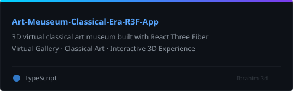
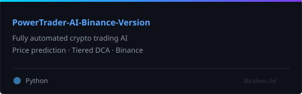
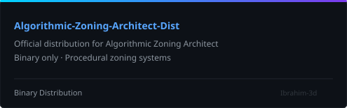
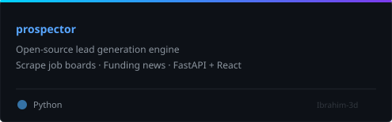
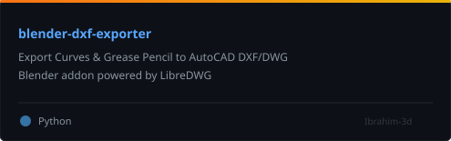

<div align="center">

<!-- HEADER -->


<!-- SOCIAL BADGES -->
[](https://github.com/Ibrahim-3d)
[](https://github.com/Ibrahim-3d)
[](https://github.com/Ibrahim-3d)
<div align="center">

</div>
</div>
<div align="center">
<a href="https://skillicons.dev">

</a>
</div>

---

## 🚀 Featured Projects
<div align="center">

<a href="https://github.com/Ibrahim-3d/conductor-orchestrator-superpowers">
  
</a>
<p>
  
  
</p>

<a href="https://github.com/Ibrahim-3d/nano-banana-claude-plugin">
  
</a>
<p>
  
  
</p>

<a href="https://github.com/Ibrahim-3d/Art-Meuseum-Classical-Era-R3F-App">
  
</a>
<p>
  
  
</p>

<a href="https://github.com/Ibrahim-3d/nano-blender">
  
</a>
<p>
  
  
</p>

<a href="https://github.com/Ibrahim-3d/PowerTrader-AI-Binance-Version">
  
</a>
<p>
  
  
</p>

<a href="https://github.com/Ibrahim-3d/Algorithmic-Zoning-Architect-Dist">
  
</a>
<p>
  
  
</p>

<a href="https://github.com/Ibrahim-3d/prospector">
  
</a>
<p>
  
  
</p>

<a href="https://github.com/Ibrahim-3d/blender-dxf-exporter">
  
</a>
<p>
  
  
</p>

</div>

---

## `> whoami`

```js
const ibrahim = {
  title: "Creative Technologist · Technical Artist",
  focus: ["3D Art & Real-time Graphics", "AI Tools", "Generative Systems"],
  currentlyBuilding: "Conductor Orchestrator Superpowers",
  funFact: "I make AI agents work together like an orchestra"
};
Technical Artist — Real-time 3D, generative art, and visual systems
AI Tool Builder — Multi-agent orchestration and Claude Code plugins
Open Source — Tools that ship and get used

```

Building at the intersection of code, art, and AI.
---

<div align="center">
<br/>  </div> 
