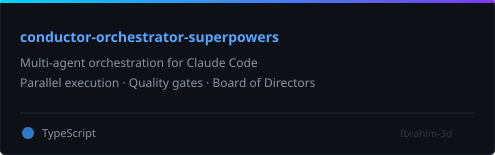
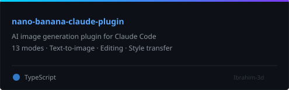
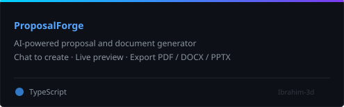
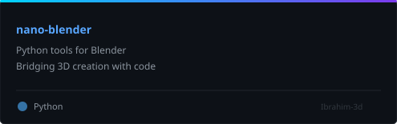

<div align="center">

<!-- HEADER -->


<!-- SOCIAL BADGES -->
[](https://github.com/Ibrahim-3d)
[](https://github.com/Ibrahim-3d)
[](https://github.com/Ibrahim-3d)

</div>

---

## ⚡ Tech Stack
<div align="center">
<a href="https://skillicons.dev">

</a>
</div>

## 📊 GitHub Stats
<div align="center">

</div>

---

## 🚀 Featured Projects
<div align="center">

<table>
<tr>
<td align="center" width="50%">
<a href="https://github.com/Ibrahim-3d/conductor-orchestrator-superpowers">
  
</a>
<p>
  
  
</p>
</td>
<td align="center" width="50%">
<a href="https://github.com/Ibrahim-3d/nano-banana-claude-plugin">
  
</a>
<p>
  
  
</p>
</td>
</tr>
<tr>
<td align="center" width="50%">
<a href="https://github.com/Ibrahim-3d/ProposalForge">
  
</a>
<p>
  
  
</p>
</td>
<td align="center" width="50%">
<a href="https://github.com/Ibrahim-3d/nano-blender">
  
</a>
<p>
  
  
</p>
</td>
</tr>
</table>

</div>

---

## `> whoami`

```js
const ibrahim = {
  title: "Full-Stack AI Engineer",
  focus: ["AI Tools", "3D Art", "Claude Code Plugins"],
  currentlyBuilding: "Conductor Orchestrator Superpowers",
  funFact: "I make AI agents work together like an orchestra"
};
AI Agent Architect — Multi-agent orchestration systems and Claude Code plugins
3D Creative — Code + 3D + generative systems
Open Source Builder — Tools that get used

```

Building AI tools that ship.
---

<div align="center">
<br/>  </div> 
